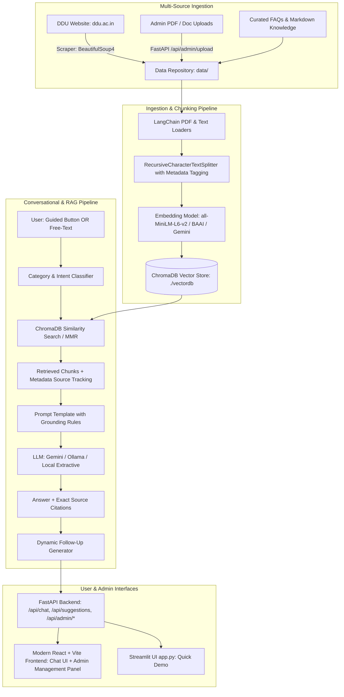

///////////////////////////////////////////////////////# 🎓 DDU AI Assistant — End-to-End University RAG System

A production-grade, resume-ready **Retrieval-Augmented Generation (RAG)** chatbot built specifically for **Dharmsinh Desai University (DDU), Nadiad**.

The assistant accurately answers questions regarding **admissions, ACPC cutoffs, the mandatory 75% attendance rule, SPI/CPI calculation formulas, fee structures, MYSY scholarships, placement statistics, department facilities, hostels, and circulars** — with verifiable **source citations** and a **Flipkart-style guided conversational UI**.

---

## 🌟 Key Features

1. **Multi-Source Knowledge Streams**:
   - **Live Web Scraper**: Crawls `ddu.ac.in` pages with `BeautifulSoup4`.
   - **Admin Document Ingestion (PDF / TXT / MD)**: Upload university circulars, rules, and placement reports with automatic parsing, chunking, and embedding.
   - **Curated Knowledge Base**: Verified datasets covering all DDU departments and academic policies.
2. **High-Precision RAG Engine**:
   - **Query Classifier**: Automatically categorizes user queries into *Admissions, Attendance, Placements, Examinations, Fees/Scholarships, Hostels, Departments, Circulars*.
   - **ChromaDB Vector Store**: Local persistent disk storage with similarity search & MMR retrieval.
   - **Strict Grounding & Source Citations**: Every response returns exact source document name, page number, confidence percentage, and extracted context chunk.
3. **Flipkart-Style Guided Conversation UX**:
   - Welcome hero with primary category cards.
   - Interactive sub-topic drilldown chips for 1-click answers without typing.
   - Dynamic post-answer follow-up suggestions based on answered context.
   - Hybrid interaction model: Seamless combination of guided buttons and natural free-text input.
4. **Interactive Placement Analytics Hub**:
   - Visual dashboard highlighting highest package (₹44 LPA), IT/CE averages (₹8.5 LPA), conversion rate (92%), branch comparison table, and top recruiters (Amazon, Morgan Stanley, Crest Data, RIL, Atul, TCS).
5. **Admin Knowledge Management Module**:
   - Drag-and-drop PDF/TXT uploader.
   - Live repository table with chunk counts and one-click deletion (auto-purges vector embeddings from ChromaDB).
   - On-demand full re-index and web-scraping triggers.
6. **Multi-Provider LLM & Embeddings Support**:
   - **Google Gemini API** (Free Tier via `langchain-google-genai`)
   - **Ollama** (e.g. `qwen2.5:7b`, `llama3.1`)
   - **Local Sentence-Transformers** (`all-MiniLM-L6-v2` / `BAAI/bge-small-en-v1.5`)
   - Extractive context synthesis fallback engine (works 100% offline with zero external API key).

---

## 🏗️ Architecture



---

## 📂 Project Structure

```
ddu_chat_bot/
├── data/                                # Knowledge Base & Configurations
│   ├── raw_uploads/                     # Admin-uploaded PDFs and documents
│   ├── suggestions_config.json          # Guided quick actions & category taxonomy
│   ├── admissions.txt                   # Seeded knowledge base files
│   ├── attendance_rules.txt
│   ├── fee_structure.txt
│   ├── examination_rules.txt
│   ├── placement_stats.txt
│   ├── departments.txt
│   ├── scholarships.txt
│   ├── hostel_facilities.txt
│   └── circulars_faqs.txt
├── scraper/                             # Web Scraping Tools
│   ├── __init__.py
│   └── ddu_scraper.py                   # BeautifulSoup crawler for ddu.ac.in
├── embeddings/                          # Ingestion & Indexing Pipeline
│   ├── __init__.py
│   ├── loader.py                        # Multi-format Document Loader (PDF & TXT)
│   ├── chunker.py                       # Recursive Text Splitter with Metadata
│   └── indexer.py                       # ChromaDB Vector Indexer & Document Manager
├── vectordb/                            # ChromaDB Persistent Storage Directory
├── backend/                             # FastAPI Application
│   ├── __init__.py
│   ├── main.py                          # FastAPI Entrypoint, CORS & Static serving
│   ├── config.py                        # App Settings (.env loader)
│   ├── models/                          # Pydantic Schemas
│   │   ├── __init__.py
│   │   └── schemas.py                   # Chat, Document, Suggestions, Analytics schemas
│   ├── services/                        # Business Logic & AI Services
│   │   ├── __init__.py
│   │   ├── rag_service.py               # Core LangChain RAG with Source Citations
│   │   ├── classifier_service.py        # Category & Intent Classifier
│   │   ├── suggestion_service.py        # Guided Suggestions & Follow-up Generator
│   │   ├── document_service.py          # Upload, Delete, & Re-index service
│   │   └── llm_factory.py               # Multi-provider LLM (Gemini, Ollama, Extractive)
│   └── routes/                          # API Endpoints
│       ├── __init__.py
│       ├── chat.py                      # /api/chat
│       ├── suggestions.py               # /api/suggestions
│       ├── admin.py                     # /api/admin/upload, /api/admin/documents, etc.
│       └── analytics.py                 # /api/analytics/*
├── frontend/                            # Modern React + Vite Frontend
│   ├── index.html
│   ├── package.json
│   ├── vite.config.js
│   └── src/
│       ├── main.jsx
│       ├── App.jsx
│       ├── index.css                    # Modern Design System (Glassmorphism & DDU Palette)
│       ├── components/
│       │   ├── Header.jsx               # University branding & Theme toggle
│       │   ├── ChatContainer.jsx        # Conversation history & message feed
│       │   ├── MessageBubble.jsx        # Rich message bubble + Source citations
│       │   ├── GuidedWelcome.jsx        # Flipkart-style welcome cards & category buttons
│       │   ├── SubTopicGrid.jsx         # Guided sub-category action selector
│       │   ├── FollowUpPills.jsx        # Dynamic post-answer follow-up buttons
│       │   ├── SourceViewerModal.jsx    # Modal showing full cited context chunk & match %
│       │   ├── AdminDrawer.jsx          # Document Upload & Knowledge Base Management Panel
│       │   └── PlacementDashboard.jsx   # Placement statistics & analytics view
│       └── services/
│           └── api.js                   # API Client for Backend
├── cron/                                # Automation Scripts
│   └── sync_knowledge_base.py           # Scheduled update worker
├── tests/                               # Test Suite
│   ├── test_scraper.py
│   ├── test_chunker.py
│   ├── test_rag_pipeline.py
│   ├── test_document_ingestion.py
│   └── test_suggestions.py
├── app.py                               # Streamlit Alternative App (single command demo)
├── requirements.txt                     # Python Dependencies
├── .env.example                         # Environment Variables Template
└── README.md                            # Documentation & Resume Guide
```

---

## 🚀 Quick Start Guide

### 1. Prerequisites
- Python 3.10+
- Node.js 18+ and npm

### 2. Backend Setup
```bash
# Clone repository and navigate to root
cd ddu_chat_bot

# Create and activate virtual environment
python -m venv .venv
# On Windows:
.venv\Scripts\activate
# On Linux/macOS:
source .venv/bin/activate

# Install dependencies
pip install -r requirements.txt

# (Optional) Add your Google Gemini API key to .env for Gemini 1.5 Flash
# GEMINI_API_KEY=your_key_here
```

### 3. Build & Run Frontend
```bash
cd frontend
npm install
npm run build
cd ..
```

### 4. Launch Application

#### Option A: Run FastAPI Server (Full Stack React + Backend)
```bash
.venv\Scripts\python -m uvicorn backend.main:app --reload
```
Open **http://127.0.0.1:8000** in your browser.

#### Option B: Run Vite Dev Server for Frontend Live Reload
```bash
# Terminal 1 (Backend):
.venv\Scripts\python -m backend.main

# Terminal 2 (Frontend Vite):
cd frontend
npm run dev
```
Open **http://localhost:5173** in your browser.

#### Option C: Run Lightweight Streamlit Interface
```bash
.venv\Scripts\streamlit run app.py
```
Open **http://localhost:8501** in your browser.

---

## 🧪 Running Tests
```bash
.venv\Scripts\python -m pytest tests
```

---

## 💼 Resume Showcase Bullet Points

> **DDU AI Assistant — End-to-End University RAG System**  
> *FastAPI, LangChain, ChromaDB, Sentence-Transformers, React, Vite, BeautifulSoup4, Python*
> - Engineered an end-to-end Retrieval-Augmented Generation (RAG) assistant for Dharmsinh Desai University (DDU) processing university policies, admissions, and placement records.
> - Implemented an automated document ingestion pipeline with LangChain `RecursiveCharacterTextSplitter`, local embeddings (`all-MiniLM-L6-v2`), and persistent vector indexing in **ChromaDB**.
> - Built a **Flipkart-style guided conversational UI** with category drill-downs, dynamic follow-up suggestions, and interactive source citation badges verifying chunk accuracy.
> - Designed an **Admin Knowledge Management Module** supporting drag-and-drop PDF ingestion, chunk deletion, and automated website scraping with BeautifulSoup.
> - Delivered a responsive **React + Vite** single-page application with dark/light glassmorphism and REST API integration with **FastAPI**.
